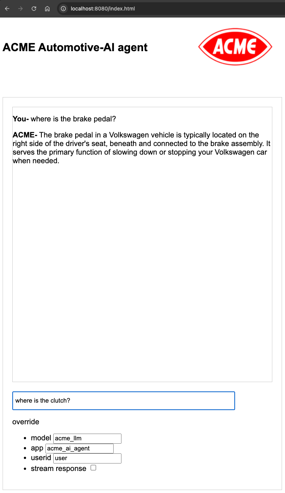

# AI Gateway patterns

This repo contains AI gateway pattern examples for use with the Layer7 gateway.

<!-- TOC -->
* [AI Gateway patterns](#ai-gateway-patterns)
  * [Get started](#get-started)
    * [Quickstart (docker on localhost)](#quickstart-docker-on-localhost)
    * [Running on an existing gateway](#running-on-an-existing-gateway)
  * [Example Rules](#example-rules)
    * [Prompt jailbreak prevention](#prompt-jailbreak-prevention)
    * [Quota per user](#quota-per-user)
    * [Quota per agent](#quota-per-agent)
  * [GenAI streaming mode via Layer7](#genai-streaming-mode-via-layer7)
  * [genAI count tracking](#genai-count-tracking)
  * [Prompt interjects](#prompt-interjects)
<!-- TOC -->

## Get started

### Quickstart (docker on localhost)

You can run on a docker host which also has ollama pre-installed.
To install ollama, refer to https://ollama.com/download/mac.

The built-in scenario leverages a local model named acme_llm. To create this model locally, run the following command:
```
ollama create acme_llm -f ./acme.model
```
Bring your own license and run docker compose with the provided docker-compose.yml.
```
cd aigw
cp /my_path/my_gateway_11_license.xml license.xml
docker compose up -d
```
Navigate to http://localhost:8080/index.html

You can now interact with the genAI models via Layer7, via your local ollama API.


### Running on an existing gateway

By default, the included configuration assumes a local execution from docker but you can also just use the configuration on your own existing gateway.
When running the local way, the API calls are directed to a docker host target:
```
host.docker.internal:11434
```
If you import the configuration for use on a gateway running elsewhere, you likely need to adjust this ollama address.
That is the address from which the existing gateway can reach the ollama API.

You can edit the json configuration file to make this adjustment:
```
  "clusterProperties": [
    {
      "name": "ollama_target",
      "description": "The host name and port number for gateway to reach the ollama api",
      "hiddenProperty": false,
      "value": "hostname_to_reach_my_ollama:11434"
    }
  ],
```
Once the configuration is adjusted to point to a different ollama, you can import it to your live gateway using [the graphman client](https://github.com/Layer7-Community/graphman-client) or you can bootstrap it using the same pattern visible in the provided docker compose yaml.

## Example Rules

Rules pertaining to the genAI API are provided in the bootstrap configuration.
By adjusting the configuration of the /myllm service, you can toggle these rules on or off.


### Prompt jailbreak prevention

This prompt is meant to only call the acme assistant which advises about volkswagen vehicles but a hacker can 'jailbreak' the prompt.
You simulate by specifying another model available on the local ollama install.

You can for example create a new model to target locally:
```
ollama create jailbreak -f ./jailbreak.model
```

Then, if you disable the model enforcement rule in the policy and ask a question outside of volkswagen, you will be able to target the wrong model.


Turn that policy back on in Layer7 and you will notice that the jailbreak fails and the response comes back from the designated safe model.

### Quota per user

Enabling this policy fragment will enforce a quota limit of 5 queries per hour per user.
When this quota is exceeded, Layer7 interjects an error into the prompt:
```
ERROR - User user has exceeded its AI token entitlements. Please try again later or contact your org admin for more credits.
```
By changing the userid field value, you control which user queries are accounted for and can continue to use the prompt again.

### Quota per agent

Enabling this policy fragment will enforce a quota limit of 7 queries per hour per agent (app).
When this quota is exceeded, Layer7 interjects an error into the prompt:
```
ERROR - Agent acme_ai_agent has exceeded its AI tokens. Please try again later.
```
By changing the app field value, you control which agent queries are accounted for and can continue to use the prompt again.

## GenAI streaming mode via Layer7

By default, the API calls to ollama are buffered by Layer7 but you can also turn on streaming.
To experience genAI streaming using the API layer and with Layer7 in front of the LLM, check the "stream response" box.

## genAI count tracking

The fragment track_query_cost tracks the LLM eval_count by requesting user and produces the sum of these eval counts over time.
You can show these value in real time by querying the endpoint "/costTracker". Costs are not accounted when using streaming mode.
Note that these values do not reflect the number of individual queries per time unit as is enforced in the quota samples but rather a sum of the AI eval costs which vary greatly from one query to another. 


Note that this accounting is currently not taking into consideration streamed mode prompt interactions.

## Prompt interjects

The policy samples provided demonstrate how to inject errors into the prompt response. For example, if you turn off Ollama local, instead of the application failing, Layer7 returns the error (configurable) into the prompt itself.


The same pattern is used by quota rules to inform users when they exceed their AI share.

You can enrich the AI with operational messages to broadcast announcements, warn users of upcoming maintenance, etc.